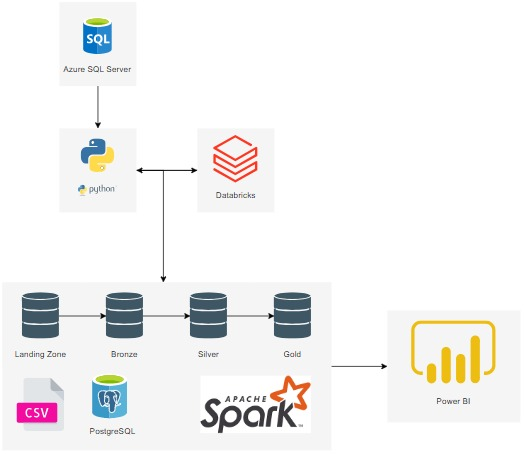

# Projeto Pipeline de Dados

## Grupo C

### Integrantes:
- **João Vitor Brogni** - [GitHub](https://github.com/Jvbrogni)
- **João Vitor Rodrigues Rocha** - [GitHub](https://github.com/JoaoVitorRodriguesRocha)
- **Lucas Fortunato Martins** - [GitHub](https://github.com/lucasfm20)

### Professor Orientador:
- **Jorge Luiz da Silva** - [GitHub](https://github.com/jlsilva01)

---

## Pré-Requisitos

Antes de começar a implantação do projeto, verifique se você possui os seguintes softwares e ferramentas instalados:

- **Render**: Plataforma de hospedagem e serviços em nuvem.
- **vsCode**: Editor de código que oferece suporte para desenvolvimento de infraestrutura com Terraform.
- **Terraform**: Ferramenta para automação da infraestrutura como código (IaC).
- **Azure CLI**: Interface de linha de comando para gerenciar recursos no Microsoft Azure.

---

### Modelo Físico

Aqui está o diagrama do **Modelo Físico** do banco de dados, que ilustra como os dados são armazenados e estruturados no sistema:


### Modelo Multidimensional

Este diagrama mostra o **Modelo Multidimensional**, que é utilizado para análise e visualização de dados em um formato mais acessível para BI:


### Arquitetura Utilizada

Aqui está o diagrama sobre a arquitetura completa utilizada no projeto.
A arquitetura do projeto organiza o fluxo de dados em etapas claras: os dados são coletados de fontes como CSV e MongoDB, armazenados na Landing Zone e processados pelo Databricks com Apache Spark, dividindo-os nas camadas Bronze (dados brutos), Silver (dados tratados) e Gold (dados prontos para análise). O Azure SQL Server é usado para persistência relacional, enquanto o Power BI fornece visualizações e dashboards interativos. Scripts em Python integram e automatizam todo o pipeline.



---

## Implantação

Siga os passos abaixo para a implantação do projeto. Este processo envolve a configuração de recursos na Azure e o uso do Terraform para provisionamento da infraestrutura.

### Passo 1: Criação da Conta na Azure
1. **Acesse a Azure**: Crie uma conta paga na [Azure](https://portal.azure.com). Se já tiver uma conta, basta fazer login.

---

### Passo 2: Clone o Repositório
1. **Clone o repositório para sua máquina local**:  
   Abra o terminal e execute o comando abaixo:

```bash
   git clone https://github.com/lucasfm20/ProjetoFinal_EngenhariaDeDados.git
```
---

### 3. Acesse a Pasta `iac` no Visual Studio

#### 3.1 Efetue o Login na Azure Através do Azure CLI
- Execute o comando:
```bash
  az login
```

#### 3.2 Valide Sua Assinatura Atual
- Para verificar as assinaturas disponíveis, execute:
```bash
  az account list -o table
```

#### 3.3 Acesse a Pasta `iac/adls`
- Navegue até a pasta `iac/adls` dentro do repositório.

#### 3.4 Rodar os Comandos e Inserir Variáveis Conforme Solicitado
- Execute os seguintes comandos dentro da pasta `iac/adls`:
  - Inicialize o Terraform:
```bash
    terraform init
```
  - Valide a configuração do Terraform:
```bash
    terraform validate
```
  - Formate os arquivos de configuração do Terraform:
```bash
    terraform fmt
```
  - Planeje a aplicação do Terraform:
```bash
    terraform plan
```
  - Aplique a configuração do Terraform:
```bash
    terraform apply
```

#### 3.5 Posteriormente, Rode os Mesmos Comandos Dentro da Pasta `iac/databricks`
- Após completar as etapas no diretório `iac/adls`, repita o processo na pasta iac/databricks.

#### 3.6 Logar no Portal da Azure e Conferir o Deploy
- Após executar todos os comandos, acesse o portal da Azure para conferir se os recursos foram provisionados corretamente.

---

### 4. No Portal da Azure, Clique na Sua Conta de Armazenamento e Gere um SAS Token
- **No Portal da Azure:** Acesse sua conta de armazenamento.
- Gere um SAS Token (Shared Access Signature) com os tipos de recursos selecionados: **Serviço, Contêiner e Objeto.** Este token será usado para acessar recursos de maneira segura.

---

### 5. No Databricks, Copie os Notebooks de Cada Camada Disponíveis na Pasta `conversaoBanco`
- **Acesse a pasta** `conversaoBanco` no repositório clonado e copie os notebooks de cada camada.
- **Carregar no Databricks:** Importe os notebooks copiados para o Databricks para começar a execução.

---

### 6. Insira os Scripts Copiados em um Notebook para Cada Camada
- Abra os notebooks no Databricks e insira os scripts conforme cada camada do pipeline de dados.
- Certifique-se de que cada camada tenha seu próprio notebook correspondente.

---

### 7. Criação de Jobs
- Você pode optar por criar um job com tarefas individuais, ou **executar os notebooks diretamente**. A criação de jobs permite agendar a execução automática de tarefas no Databricks.

---

### 8. Transformação e Processamento dos Dados na Arquitetura Medalhão

#### 8.1 - Camada Landing
- Os dados gerados foram movidos para a **camada Landing**, sendo armazenados em sua forma bruta, sem qualquer transformação inicial.  
- Configurações foram realizadas para permitir que as camadas subsequentes recebessem os dados processados.  
- Uma tabela foi criada para validar se os valores estavam corretos e devidamente carregados nesta camada.

#### 8.2 - Camada Bronze
- Os dados brutos da **camada Landing** foram processados e salvos na **camada Bronze**.  
- Durante o processamento, os dados foram convertidos para o formato **Delta Lake**, otimizando consultas e armazenamento.  
- Verificações adicionais garantiram que os valores estavam corretos e que os dados foram armazenados adequadamente.

#### 8.3 - Camada Silver
- A partir dos dados da **camada Bronze**, novos processamentos foram realizados para salvá-los na **camada Silver**.  
- Nesta etapa, ocorreram transformações específicas:  
  - Ajustes detalhados na tabela **"corretor"**.  
  - Modificações pontuais em outras tabelas, conforme necessário.  

#### 8.4 - Camada Gold
- Os dados da **camada Silver** foram refinados e armazenados na **camada Gold**.  
- Foi criada uma tabela final consolidada para atender às necessidades de análise.  
- Arquivos armazenados em formato CSV na **camada Gold** foram lidos e convertidos para o formato **Delta**, utilizado nos DataFrames.  
- Foi realizada a **junção (join)** de DataFrames para inserir e configurar os valores necessários na tabela final.  
- Por fim, análises detalhadas foram feitas para garantir a correta montagem da tabela consolidada e a qualidade dos dados processados.

---